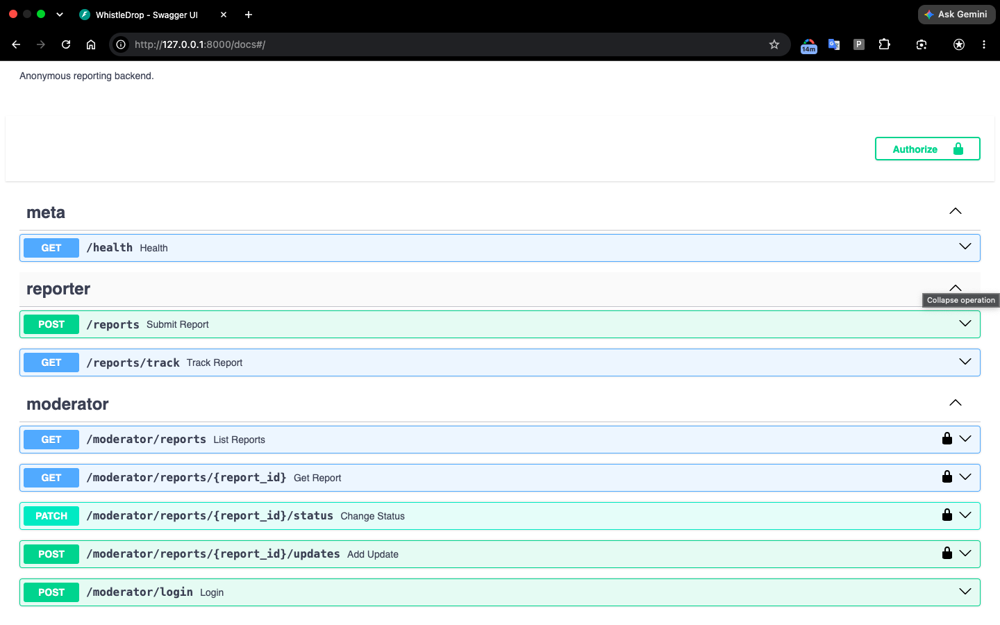
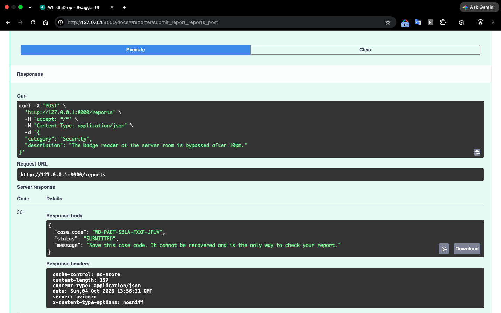
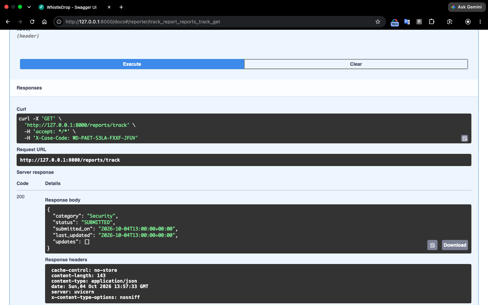
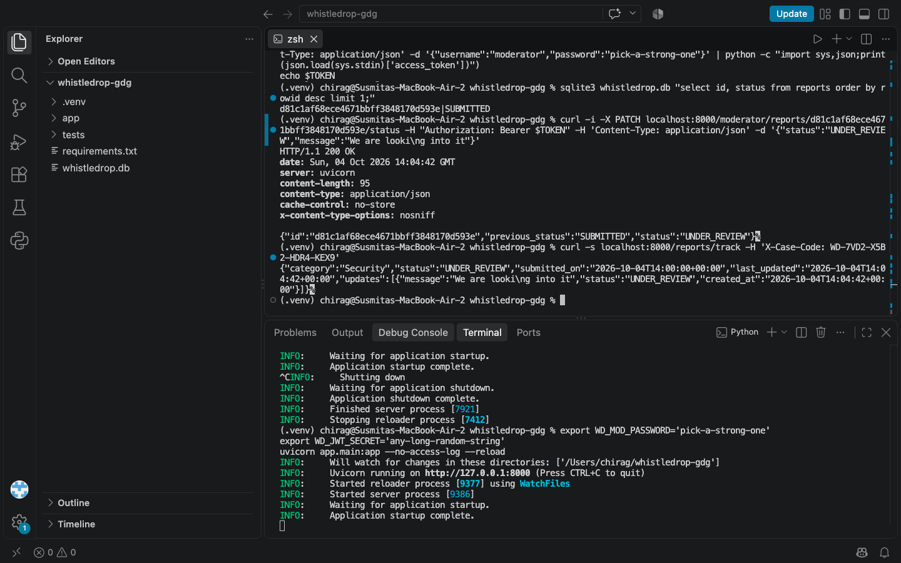

# WhistleDrop

A backend for anonymous reporting. Anyone can submit a report without an account and
get a secret case code to track it. Moderators review reports but can never see who
sent them.

Built with Python, FastAPI and SQLite.

## Setup

```bash
python3 -m venv .venv
source .venv/bin/activate
pip install -r requirements.txt

export WD_JWT_SECRET='a-long-random-string'
export WD_CASE_PEPPER='another-long-random-string'
export WD_MOD_PASSWORD='choose-a-password'
uvicorn app.main:app --no-access-log
```

Open http://127.0.0.1:8000/docs to try the API.
The moderator username is `moderator`. `--no-access-log` stops the server from
logging IP addresses.

## Endpoints

| Endpoint | Who | What it does |
|---|---|---|
| `POST /reports` | anyone | Submit a report, get a case code |
| `GET /reports/track` | reporter | Check status and updates (send the code in the `X-Case-Code` header) |
| `POST /moderator/login` | moderator | Get a login token |
| `GET /moderator/reports` | moderator | List reports, filter by `category` and `status` |
| `GET /moderator/reports/{id}` | moderator | View one report |
| `PATCH /moderator/reports/{id}/status` | moderator | Change status, with an optional message |
| `POST /moderator/reports/{id}/updates` | moderator | Add a status update |

Categories: Security, Harassment, Corruption, Technical, Other.

Status flow: `SUBMITTED -> UNDER_REVIEW -> RESOLVED or DISMISSED`.
RESOLVED and DISMISSED are final. Invalid moves return `409`.

## Examples

Submit a report:

```bash
curl -X POST localhost:8000/reports -H 'Content-Type: application/json' \
  -d '{"category":"Security","description":"Badge reader is bypassed after 10pm."}'
```
```json
{"case_code": "WD-7K2M-QX9P-4HTD-WE6R", "status": "SUBMITTED", "message": "Save this case code..."}
```

Check progress:

```bash
curl localhost:8000/reports/track -H 'X-Case-Code: WD-7K2M-QX9P-4HTD-WE6R'
```
```json
{"category": "Security", "status": "UNDER_REVIEW", "updates": [{"message": "We are looking into it"}]}
```

Invalid status change:

```json
{"detail": {"error": "Cannot move from SUBMITTED to RESOLVED", "allowed_transitions": ["UNDER_REVIEW"]}}
```

## Screenshots






## How anonymity is kept

- The database has no column for the reporter's identity: no user, email, IP or device.
- The case code is random and has 80 bits of entropy, so it can't be guessed. It is
  shown once and never stored. Only a keyed hash (HMAC-SHA256) is saved, so a stolen
  database can't be used to open reports.
- Moderators see random report IDs, never case codes or hashes.
- Timestamps are rounded to the hour so a report can't be matched to someone's activity.
- The case code is sent in a header, not the URL, so it stays out of logs.
- Rate limiting is kept in memory only, so no IP addresses are saved.

## Design decisions

- The status rules are a simple dictionary in `app/config.py`, so they are easy to change.
- Status updates use compare-and-set, so two moderators can't overwrite each other.
- Every status change also adds an update, which gives the reporter a timeline.
- A lost case code can't be recovered. This is deliberate.
- There is one moderator account, set through environment variables.